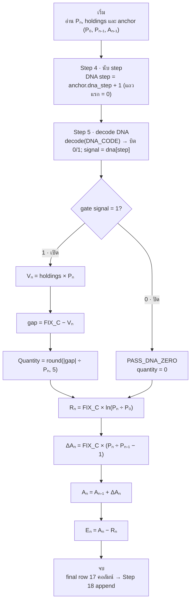
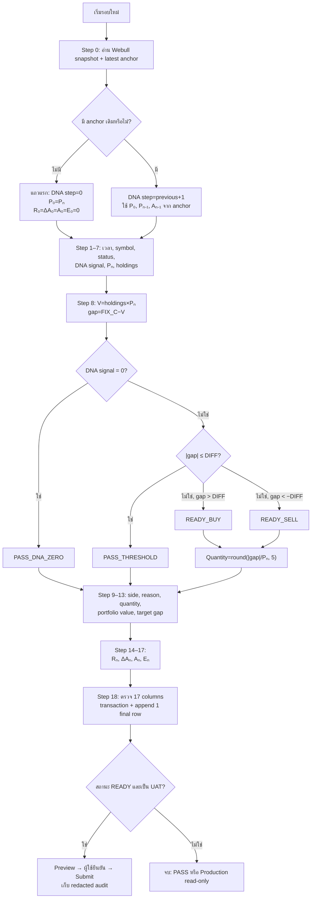

# LEGO Equation Flowchart

สร้างแผนภาพที่คนอ่านเห็นทางเดินตั้งแต่รับข้อมูลจนได้ final row โดยไม่ต้องอ่านโค้ดก่อน

## Workflow

1. ตรวจ source ปัจจุบันเมื่ออยู่ใน repository โดยอ่านเฉพาะส่วนที่เกี่ยวข้อง:
   - `lego_one_row.py` — pipeline สมการ Step 0–17 (`dna_step_for`, `dna_signal_for`, `build_decision`, `compute_recurrence`, `compute_row`)
   - `manual_tools.py` — `decode_dna` ที่แปลง `DNA_CODE` เป็นอาเรย์ gate 0/1
   - `lego_state.py` — Step 18 transaction ที่ append final row
   - `lego_orders.py` — เส้นทาง Preview/Submit ของ UAT
   - `lego_dashboard.py` — UI ที่เรียกใช้ pipeline
2. ใช้คำและสมการจาก implementation จริง หากขัดกับ template ด้านล่างให้ยึด implementation และแจ้งความต่างสั้น ๆ
3. ถ้าผู้ใช้ขอ "แบบง่าย ๆ" หรือขอเฉพาะ "ทางเดินสมการ" ให้ส่งออก **Simple equation flowchart** (เส้นตรง ต้น→จบ) เป็นค่าเริ่มต้น
4. ถ้าผู้ใช้ขอภาพเต็มที่มี decision PASS/BUY/SELL ให้ใช้ **Canonical calculation path** แล้วตามด้วยตารางสมการสั้น ๆ
5. รวม Step ที่เป็นการเปิดเผยค่าจาก object เดียวกันเพื่อลดความรก:
   - Step 1–7: สร้างข้อมูลพื้นฐานของ draft row
   - Step 8–13: คำนวณ decision ครั้งเดียวแล้วเปิดเผยผล
   - Step 14–17: คำนวณ ledger recurrence
6. ใช้ node ไม่เกินประมาณ 18 nodes และใช้ข้อความภาษาไทยง่าย ๆ
7. แสดงชัดเจนว่า pipeline อ่านเพียง current snapshot และ latest anchor หนึ่งแถว ห้ามวาด history หลายแถวเป็น input
8. แสดง Step 18 เป็น transaction ที่ append final row หนึ่งเอกสาร พร้อม idempotency และ stale-anchor guard
9. วาด Preview/Submit หลัง Step 18 เท่านั้น แยกจาก calculation flow และระบุว่า UAT เท่านั้น; Production read-only

## Simple equation flowchart

แผนภาพสมการแบบง่าย — เส้นตรงตั้งแต่รับราคาจนได้ final row ใช้เป็นค่าเริ่มต้นเมื่อผู้ใช้ขอ "ทางเดินสมการ ต้น จน จบ":

หมายเหตุแผนภาพง่าย:

- อ่านค่าเดียว: current snapshot (Pₙ, holdings) กับ anchor แถวเดียว (P₀, Pₙ₋₁, Aₙ₋₁) ไม่มี history หลายแถว
- **นับ step (Step 4):** `dna_step = anchor.dna_step + 1`, chain ใหม่เริ่มที่ `0` และเก็บต่อเนื่องใน state ข้ามแถว
- **decode DNA (Step 5):** `decode_dna(DNA_CODE)` → อาเรย์ `0/1` ความยาวคงที่ (`bypass:100` = `1` ครบ 100 ช่อง); `dna[0] = 1` เสมอ (แถวแรก gate เปิด)
- **gate 0/1:** `signal = dna[step]` — `0` = ปิด → `PASS_DNA_ZERO` (quantity 0); `1` = เปิด → คิด gap ต่อ (BUY/SELL/PASS_THRESHOLD)
- **DNA หมด:** `step ≥ len(dna)` → fail closed (`"DNA exhausted"`)
- แถวแรก (ไม่มี anchor) ใช้ `P₀ = Pₙ` และ `R₀ = ΔA₀ = A₀ = E₀ = 0`
- `gap` และ `Quantity` เป็นสาย decision; `Rₙ → ΔAₙ → Aₙ → Eₙ` เป็นสาย ledger recurrence ที่คิดทุกแถวไม่ว่า gate เปิดหรือปิด

## Canonical calculation path

ใช้ทางเดินนี้เมื่อผู้ใช้ต้องการภาพเต็มพร้อม decision PASS/BUY/SELL:

## Equation legend

แสดงตารางนี้ใต้แผนภาพ:

| ค่า | สมการ/กฎ |
|---|---|
| DNA step (นับ step) | `anchor.dna_step + 1` (แถวแรก = `0`) |
| DNA signal (gate) | `decode_dna(DNA_CODE)[dna_step]` ∈ `{0, 1}` |
| มูลค่าพอร์ต `Vₙ` | `holdings × Pₙ` |
| Target gap | `FIX_C − Vₙ` |
| Quantity | `round(abs(gap) / Pₙ, 5)` |
| Reference `Rₙ` | `FIX_C × ln(Pₙ / P₀)` |
| Delta actual `ΔAₙ` | `FIX_C × (Pₙ / Pₙ₋₁ − 1)` |
| Actual cumulative `Aₙ` | `Aₙ₋₁ + ΔAₙ` |
| Excess `Eₙ` | `Aₙ − Rₙ` |

เพิ่มหมายเหตุสั้น ๆ ว่า:

- แถวแรกใช้ `P₀=Pₙ` และ `R₀=ΔA₀=A₀=E₀=0`
- DNA เป็น gate ต่อ 1 step: `signal=0` บังคับ `PASS_DNA_ZERO`; `signal=1` จึงพิจารณา gap; `step` เกินความยาว DNA ต้อง fail closed
- ข้อมูลไม่ครบ, ราคาไม่เป็นบวก หรือ quantity เป็นศูนย์ต้อง fail closed
- Step 8 สร้าง decision เพียงครั้งเดียว และ Step 9–13 อ่านจาก decision เดียวกัน
- การกด Step 18 ซ้ำด้วย `run_id` เดิมต้องไม่สร้างเอกสารซ้ำ

## Output rules

- เริ่มด้วยแผนภาพทันที ไม่เกริ่นยาว
- ค่าเริ่มต้นคือ **Simple equation flowchart**; ใช้ **Canonical calculation path** เมื่อผู้ใช้ขอ decision เต็ม
- ใช้ชื่อ variable เดิมให้สม่ำเสมอ: `FIX_C`, `DIFF`, `P₀`, `Pₙ`, `Pₙ₋₁`, `Aₙ₋₁`
- อธิบายแต่ละสมการไม่เกินหนึ่งประโยค
- หาก Mermaid renderer ไม่รองรับอักษรห้อย ให้คงสมการใน code span และใช้ชื่อภาษาอังกฤษกำกับ
- หากผู้ใช้ขอไฟล์ ให้บันทึกเป็น Markdown ที่มี Mermaid หรือแปลงเป็นรูปตามรูปแบบที่ผู้ใช้ระบุ
