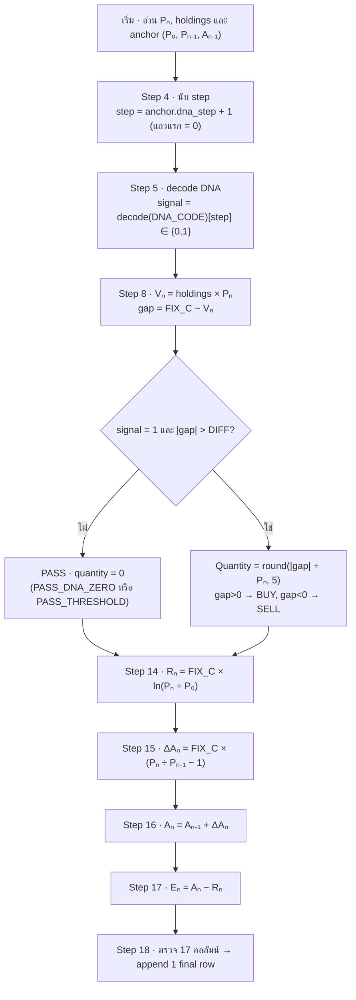
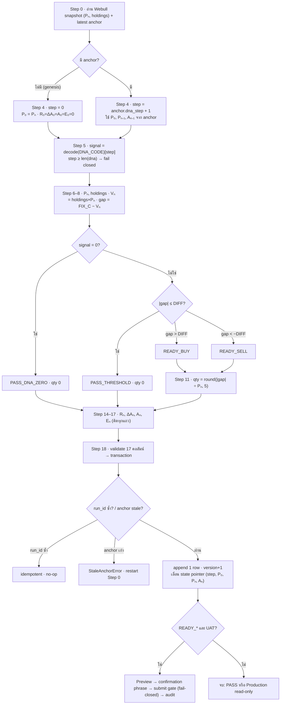

# LEGO Equation Flowchart

สร้างแผนภาพและตารางสมการที่ **ตรงกับ implementation จริงเป๊ะ** เพื่อให้คนอ่านเห็นทางเดินตั้งแต่รับ snapshot จนได้ final row และ persist โดยไม่ต้องอ่านโค้ดก่อน

## แหล่งความจริง (ยึด implementation เสมอ)

ตรวจไฟล์เหล่านี้ก่อนเผยแพร่ หากขัดกับ template ในไฟล์นี้ให้ยึดโค้ดและแจ้งความต่างสั้น ๆ:

| ไฟล์ | ขอบเขต | สัญลักษณ์สำคัญ |
|---|---|---|
| `lego_one_row.py` | Step 0–17: snapshot/anchor, DNA, decision, recurrence, 17 คอลัมน์ | `dna_step_for`, `dna_signal_for`, `build_decision`, `compute_recurrence`, `compute_row`, `build_final_document`, `validate_row_columns` |
| `lego_state.py` | Step 18: transaction, idempotency, stale-anchor guard | `plan_commit`, `commit_final_row`, `_state_document` |
| `lego_orders.py` | เส้นทาง order UAT (Preview/Submit) | `evaluate_submit_gate`, `order_confirmation_phrase`, `summarize_order_result` |
| `manual_tools.py` | ถอด DNA เป็น gate 0/1 | `decode_dna`, `parse_dna_spec`, `dna_summary`, `DEFAULT_ORDER_DECIMAL_PRECISION` |

Firestore 3 collections: `webull_lego_rows/{run_id}` (row immutable), `webull_lego_state/{chain_key}` (pointer + recurrence baseline), `webull_lego_order_audit/{event_id}` (redacted).

## ค่าคงที่และค่าเริ่มต้น

| ชื่อ | ค่า | ที่มา |
|---|---|---|
| `FIX_C` (`fix_c`) | ต้อง finite และ `> 0` | เป้ามูลค่าพอร์ต |
| `DIFF` (`diff`) | default `0.0`, ต้อง `≥ 0` | ครึ่งความกว้างแถบ no-trade |
| `dna_code` | default `"bypass:100"` | โค้ด DNA |
| `strategy_id` | default `"shannon_demon_lego"` | — |
| `decimal_precision` | default `5` (`DEFAULT_ORDER_DECIMAL_PRECISION`) | ทศนิยม quantity |
| `DECISION_STAGE` | `8` | ก่อน Step 8 สถานะ draft = `SNAPSHOT_READY` |
| สถานะ (5 ค่า) | `SNAPSHOT_READY`, `PASS_DNA_ZERO`, `PASS_THRESHOLD`, `READY_BUY`, `READY_SELL` | `lego_one_row.py` |
| environment | `"Test (UAT)"` = ส่ง order ได้, `"Production"` = read-only | `lego_orders.py` |

> การเปลี่ยน `strategy_id`, `fix_c`, `diff`, `decimal_precision` หรือ DNA ทำให้ `config_hash` เปลี่ยน → **เริ่ม chain ใหม่**

## สัญญา 17 คอลัมน์ (ลำดับตายตัว)

`validate_row_columns` จะ fail closed ถ้าคอลัมน์ไม่ครบ 17 หรือผิดลำดับ

| Step | คอลัมน์ | ค่า/สมการ |
|---|---|---|
| 1 | `เวลา (UTC)` | `snapshot.captured_at` |
| 2 | `สินทรัพย์` | symbol ของ snapshot |
| 3 | `สถานะ` | `SNAPSHOT_READY` จนถึง Step 8 แล้วเป็นสถานะ decision |
| 4 | `DNA step` | `anchor.dna_step + 1` (แถวแรก = `0`) |
| 5 | `DNA signal` | `decode_dna(DNA_CODE)[dna_step]` ∈ `{0,1}` |
| 6 | `ราคา Pₙ (USD)` | live quote (`> 0`) |
| 7 | `จำนวนถือครอง (หุ้น)` | live position (`0` ถ้าไม่มี) |
| 8 | `คำสั่ง` | `action` จาก `build_decision` (สร้างครั้งเดียว) |
| 9 | `ฝั่ง` | `side` (`PASS` = ว่าง) |
| 10 | `เหตุผล` | `reason` = สถานะ decision |
| 11 | `จำนวนสั่ง (หุ้น)` | `round(abs(gap)/Pₙ, decimal_precision)`; PASS = `0` |
| 12 | `มูลค่าพอร์ต (USD)` | `Vₙ = holdings × Pₙ` |
| 13 | `ส่วนต่างเป้าหมาย (USD)` | `gap = FIX_C − Vₙ` |
| 14 | `Rₙ อ้างอิง (USD)` | `FIX_C · ln(Pₙ / P₀)` |
| 15 | `ΔAₙ ต่อสเต็ป (USD)` | `FIX_C · (Pₙ / Pₙ₋₁ − 1)` |
| 16 | `Aₙ สะสม (USD)` | `Aₙ₋₁ + ΔAₙ` |
| 17 | `Eₙ ส่วนเกินสะสม (USD)` | `Aₙ − Rₙ` |

> **Step 8 สร้าง decision ครั้งเดียว** — `Vₙ`, `gap`, `action`, `side`, `reason`, `quantity` มาจาก object เดียว; Step 9–13 แค่เปิดเผยค่าจาก object นั้น (ลำดับเปิดเผยต่างจากลำดับคำนวณ)
> คอลัมน์เงิน 7 ตัว (6, 12–17) เก็บ full precision แล้ว round 2 dp เฉพาะตอนแสดง/ส่งออก (`columns_presented`); quantity round ตาม `decimal_precision`

## สมการ (legend)

| ค่า | สมการ/กฎ |
|---|---|
| DNA step | `anchor.dna_step + 1` (แถวแรก = `0`) — **+1 ทุกแถวเสมอ** |
| DNA signal (gate) | `decode_dna(DNA_CODE)[dna_step]` ∈ `{0,1}` |
| มูลค่าพอร์ต `Vₙ` | `holdings × Pₙ` |
| Target gap | `FIX_C − Vₙ` |
| Quantity | `round(abs(gap) / Pₙ, 5)` (PASS = 0) |
| Reference `Rₙ` | `FIX_C × ln(Pₙ / P₀)` |
| Delta actual `ΔAₙ` | `FIX_C × (Pₙ / Pₙ₋₁ − 1)` |
| Actual cumulative `Aₙ` | `Aₙ₋₁ + ΔAₙ` |
| Excess `Eₙ` | `Aₙ − Rₙ` |

แถวแรก (ไม่มี anchor): `P₀ = Pₙ` และ `R₀ = ΔA₀ = A₀ = E₀ = 0`

## Invariants / guards (fail closed ทั้งหมด)

1. **อินพุตเดียว:** อ่าน current snapshot (Pₙ, holdings) + latest anchor หนึ่งแถวเท่านั้น — ไม่ลาก history หลายแถว
2. **DNA decode ถูกล็อกตาม slot:** `decode_dna` ให้อาเรย์ `0/1` ความยาวคงที่ (`bypass:N` = 1 ครบ N ช่อง; spec ใช้ seed+mutation), `dna[0] = 1` เสมอ; index = slot เวลา
3. **step +1 ทุกแถวเสมอ:** ทุกแถวใหม่กิน 1 slot ไม่ว่า PASS หรือเทรด; ห้ามข้าม/ซ้ำ; `step ≥ len(dna)` → fail closed (`"DNA exhausted"`)
4. **gate:** `signal = 0` → บังคับ `PASS_DNA_ZERO` (quantity 0); `signal = 1` จึงพิจารณา gap
5. **decision band:** `|gap| ≤ DIFF` → `PASS_THRESHOLD`; `gap > DIFF` → `READY_BUY`; `gap < −DIFF` → `READY_SELL`
6. **recurrence คิดทุกแถว:** `Rₙ→ΔAₙ→Aₙ→Eₙ` ขึ้นกับราคา/anchor เท่านั้น ไม่ขึ้นกับ decision; ราคา ≤ 0 หรือ `p0/prev_price ≤ 0` → fail closed
7. **Step 18 idempotent:** `run_id = hash(chain_key, anchor.version, snapshot)[:32]`; กดซ้ำด้วย snapshot/anchor เดิม → no-op ไม่สร้างเอกสารซ้ำ
8. **Step 18 stale-anchor + monotonic:** `anchor.version` ต้องเท่ากับ `state.version` มิฉะนั้น `StaleAnchorError` ("restart Step 0"); commit ได้ทำ `version = current + 1` และเลื่อน state pointer (`dna_step`, `p0`, `prev_price=Pₙ`, `prev_actual=Aₙ`) → เป็น anchor ของแถวถัดไป
9. **UAT เท่านั้น:** Preview/Submit ใช้ได้เฉพาะ `Test (UAT)` และหลัง Step 18 persist แถว `READY_BUY/READY_SELL`; `evaluate_submit_gate` fail-closed (payload valid + preview ตรง + confirmation phrase ตรง + ไม่ใช่ Production); Production block เสมอ
10. **ไม่โม้ fill:** `summarize_order_result` เรียก `FILLED` เฉพาะสถานะ filled ชัดเจน; `SUBMITTED/PENDING` ไม่นับเป็น realized

## Workflow

1. ตรวจ source ตามตาราง "แหล่งความจริง" เฉพาะส่วนที่เกี่ยวข้อง แล้วยึดค่าจริง
2. เลือกแผนภาพ:
   - ผู้ใช้ขอ "แบบง่าย" / "ทางเดินสมการ" → **แผนภาพ A** (เส้นทางสมการ ~12 nodes)
   - ผู้ใช้ขอภาพเต็ม decision/persist/UAT → **แผนภาพ B** (canonical)
3. ตามด้วยตารางสมการ (legend) เสมอ และอธิบายแต่ละสมการไม่เกินหนึ่งประโยค
4. ใช้ชื่อ variable/สถานะเดิมให้สม่ำเสมอ และคง Step number ให้ตรงตาราง 17 คอลัมน์

## แผนภาพ A — เส้นทางสมการ (ต้น → จบ)

## แผนภาพ B — Canonical full path

## Output rules

- เริ่มด้วยแผนภาพทันที ไม่เกริ่นยาว; ค่าเริ่มต้นใช้ **แผนภาพ A**, ใช้ **แผนภาพ B** เมื่อผู้ใช้ขอภาพเต็ม
- ใช้ชื่อเดิมสม่ำเสมอ: `FIX_C`, `DIFF`, `P₀`, `Pₙ`, `Pₙ₋₁`, `Aₙ₋₁` และสถานะทั้ง 5
- อธิบายแต่ละสมการไม่เกินหนึ่งประโยค; ทุกตัวเลข/สูตรต้องตรงตาราง 17 คอลัมน์และ legend
- หาก Mermaid renderer ไม่รองรับอักษรห้อย ให้คงสมการใน code span และกำกับชื่ออังกฤษ
- หากผู้ใช้ขอไฟล์ ให้บันทึกเป็น Markdown ที่มี Mermaid หรือแปลงเป็นรูป/HTML ตามที่ผู้ใช้ระบุ
- หากพบว่าโค้ดต่างจากไฟล์นี้ ให้ยึดโค้ด แก้แผนภาพ และระบุความต่างให้ผู้ใช้ทราบ
